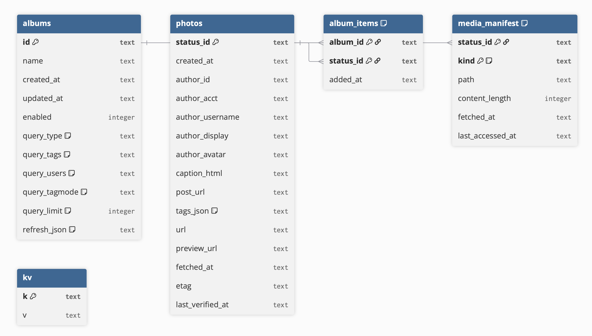

# PixelFree Virtual Albums – Thoughts on Design

This document captures ideas about **Virtual Albums**, starting from the design of the frontend/backend HTTP API, through the internal backend repository interfaces, and other suggested structure. A partial framework for Virtual Albums exists in the code base.


## 1. Public HTTP API (Frontend ⇄ Backend)

All endpoints are under `/api/albums` and require an authenticated session (OAuth).  
Responses use `application/json`. Errors use the standardized shape:

```json
{ "error": { "code": "BadRequest", "message": "…" } }
```

### 1.1 Create album
**POST** `/api/albums`

Create a new virtual album from a query definition.

**Request**

```json
{
  "name": "Retro Macs",
  "query": {
    "type": "tag" | "user" | "compound",
    "tags": ["retrocomputing","classicmac"],
    "users": { "accts": ["@bits@mastodon.social"] },
    "tagmode": "any" | "all",
    "limit": 40
  },
  "refresh": { "intervalMs": 600000 }
}
```

**Response (201)**

```json
{
  "id": "alb_01HQ0…",
  "name": "Retro Macs",
  "query": { "type":"tag","tags":["retrocomputing","classicmac"],"tagmode":"all","limit":40 },
  "refresh": { "intervalMs": 600000, "last_checked_at": null, "backoff_until": null,
               "since_id": null, "max_id": null },
  "stats": { "total": 0 },
  "enabled": true,
  "created_at": "2025-08-29T02:15:20Z",
  "updated_at": "2025-08-29T02:15:20Z"
}
```


### 1.2 Get album by id
**GET** `/api/albums/:id`

**Response (200)**

```json
{
  "id": "alb_01HQ0…",
  "name": "Retro Macs",
  "query": { "type":"tag","tags":["retrocomputing","classicmac"],"tagmode":"all","limit":40 },
  "refresh": { "intervalMs": 600000, "last_checked_at": "2025-08-29T02:30:02Z", "since_id": "8569…" },
  "stats": { "total": 128, "last_added": "2025-08-29T02:28:30Z" },
  "enabled": true,
  "created_at": "2025-08-29T02:15:20Z",
  "updated_at": "2025-08-29T02:30:02Z"
}
```


### 1.3 List albums
**GET** `/api/albums?offset=0&limit=20&enabled=true`

**Response (200)**

```json
{
  "items": [ { "id":"alb_…", "name":"Retro Macs", "query":{…}, "stats":{ "total":128 } } ],
  "total": 3,
  "offset": 0,
  "limit": 20
}
```

### 1.4 Update album
**PATCH** `/api/albums/:id`

Supports updates to name, query, or refresh policy.


### 1.5 Enable/disable album
**POST** `/api/albums/:id/toggle`


### 1.6 Delete album
**DELETE** `/api/albums/:id`


### 1.7 Manual refresh
**POST** `/api/albums/:id/refresh`


### 1.8 Get photos in an album
**GET** `/api/albums/:id/photos?offset=0&limit=20`


## 2. Internal Backend Interfaces

These are abstractions for repositories and services used internally.

### 2.1 Album Repository
- `create(album)`
- `get(id)`
- `list({ offset, limit, enabled })`
- `update(id, patch)`
- `toggle(id, enabled)`
- `remove(id)`
- `addPhotos(albumId, statusIds)`
- `listItems(albumId, { offset, limit })`

### 2.2 Photo Repository
- `upsertMany(photos)`
- `getMany(ids)`
- `listForAlbum(albumId, { offset, limit })`
- `removeUnreferenced()`

### 2.3 Media Cache
- `ensureCached(photo)`
- `touch(statusId)`
- `evict(by)`

### 2.4 Accounts Service
- `resolveAccountId(acct)`
- `resolveManyAccts(accts)`

### 2.5 Fetcher / Scheduler
- `refreshAlbum(album)`
- `scheduleTick()`


## 3. Status & Errors

Common HTTP status codes and standardized error shapes.

Common status codes

+ 200 OK normal read/refresh.
+ 201 Created on album creation.
+ 204 No Content on delete.
+ 400 Bad Request invalid query (e.g., unknown tagmode, empty query).
+ 401 Unauthorized not logged in.
+ 404 Not Found album ID doesn’t exist.
+ 409 Conflict conflicting name (if you enforce uniqueness).
+ 429 Too Many Requests rate-limited upstream; include retryAfter.
+ 5xx for unexpected server errors (mapped via your errorMapper).

Error body

```json
{ "error":
  {
    "code": "ValidationError",
    "message": "tags must be non-empty",
    "details": {...}
  }
}
```

## 4. SQLite Schema & Repositories

The PixelFree backend uses an SQLite database to manage virtual albums, photo metadata, media caching, and app-level state. The schema is designed to balance simplicity, performance, and federated content constraints, while allowing for future extension.

**Schema Overview**

- `albums` – stores album metadata, query, and refresh state.
- `photos` – normalized metadata for fetched posts.
- `album_items` – join table linking albums to photos.
- `media_manifest` – manages local cache of media files.
- `kv` – key-value store for app metadata.

### Table: albums

**Purpose**: Defines virtual albums, which represent saved queries configured by the user.

**Key Fields**:

+ id (PK): Unique identifier for the album.
+ name: Human-readable label for the album.
+ type: Query type (tag, user, compound).
+ tags[]: Normalized list of tags included in the query.
+ user_ids[]: Resolved account IDs to restrict posts by author.
+ refresh_interval_ms: How often this album should refresh.
+ last_checked_at: Timestamp of last successful refresh.
+ since_id, max_id: Pagination watermarks for incremental fetch.
+ status_ids[]: List of associated photo IDs (denormalized cache).

**Usage**: Albums define how photos are selected and refreshed. For example: “All photos tagged #retrocomputing from @icm@mastodon.sdf.org, refreshed every 15 minutes.”

### Table: photos

**Purpose**: Stores normalized metadata for individual posts fetched from Pixelfed/Mastodon-compatible APIs.

**Key Fields**:

+ status_id (PK): Global unique identifier for the post.
+ author_id, acct: Link to the post author.
+ created_at: When the post was created.
+ tags[]: Normalized tags applied to the post.
+ caption: Raw HTML/Markdown caption text.
+ post_url: Link to the original post.
+ url, preview_url: Media URLs provided by the source.

**Usage**: Acts as the canonical store of post metadata. Multiple albums may reference the same photo without duplication.

### Table: album_items

**Purpose**: Join table linking albums ↔ photos, supporting many-to-many relationships.

**Key Fields**

+ album_id (FK → albums.id).
+ photo_id (FK → photos.status_id).
+ added_at: When this photo was added to the album’s set.

**Usage**: Provides efficient queries like “fetch all photos in album X” or “find all albums containing photo Y.”

### Table: media_manifest

**Purpose**: Manages the local cache of media files (downloaded images).

**Key Fields**

+ status_id (FK → photos.status_id).
+ local_path: Filesystem location of cached media.
+ content_length: Size of the file on disk.
+ fetched_at: Last time this file was retrieved.
+ expires_at: Optional TTL for cache eviction.

**Usage**: Allows the backend to serve media from local disk for offline use, while respecting quota limits (LRU/TTL eviction).

### Table: kv

**Purpose**: Lightweight key-value store for app-wide metadata.

**Fields**

+ key: String key.
+ value: JSON/text payload.

**Usage**: Used for global state such as:

+ Last schema migration applied.
+ Global sync watermarks.
+ Miscellaneous flags not worth creating full tables for.

ER Diagram:


## 5. Frontend Flow

- **Create album** → `POST /api/albums`
- **Refresh** → `POST /api/albums/:id/refresh`
- **Display** → `GET /api/albums/:id/photos`
- **Update settings** → `PATCH /api/albums/:id`
- **Delete** → `DELETE /api/albums/:id`

## 6. Relationship to the Caching Layer

PixelFree implements a two-layer cache:

1.	Metadata cache
  + Structured records about posts/photos and album membership.
  + Backed by SQLite tables: photos, albums, album_items, and kv.
2.	Media cache
  + Binary image files on disk with a manifest for bookkeeping.
  + Backed by SQLite table: media_manifest plus the local filesystem.

This separation lets us refresh quickly, render from local data, and throttle network usage—even with intermittent connectivity and partial federation.

**1) Schema ↔ Cache Mapping**

| Cache concern                    | Table | Notes  |
|----------------------------------|----------------|--------|
| Album definition & refresh state | albums         | Stores query type ( tag / user / compound ), normalized   tags , resolved   user_ids , and refresh controls ( refresh\_interval\_ms ,   last\_checked\_at ,   since\_id ,   max\_id , optional   backoff\_until). | 
|Photo/post metadata (normalized)|     photos           |   One row per remote post (status\_id PK). Holds author, timestamps, caption, normalized tag list, canonical/post URLs, preview\_url/url. |
|Album membership (N↔M) |album_items| Links albums to photos; supports stable album ordering (by created\_at or added\_at).|
|Media file bookkeeping |media\_manifest| Maps status\_id → local\_path, content\_length, fetched\_at, optional expires\_at. Enables LRU/TTL eviction and quick “is this file cached?” checks.|
|Global app state |kv| Lightweight store for cross-cutting metadata (e.g., schema version, global backoff flags, last successful global sync).| 

**2) Refresh Flow (Scheduler → DB)**

1. Select due albums
	   • A scheduler picks albums whose last_checked_at + refresh_interval_ms has elapsed (with jitter). It also respects any per-album backoff_until set after rate limiting.
2. Fetch candidates
  + Tag OR: call tag timelines for each tag (union).
  + User OR: call statuses for each user (union).
  + Compound: fetch from users first, then local filter by tags.
  + Tag mode (any vs all): applied locally using photos.tags to avoid federated timeline gaps.
3.	Upsert metadata
	    • For each remote post, upsert into photos (idempotent).
	    • Insert/ensure link in album_items for this album and status_id.
	    • Update album watermarks (since_id, max_id) and set last_checked_at = now().
4.	Media cache (optional, deferred)
	    • On refresh, we do not fetch full media by default. We keep preview_url for fast first paint.
	    • A background step (or on-view) may fetch the original, writing a row to media_manifest and the file to disk.

**Why local filtering matters**: timelines served by federated instances can be incomplete; persisting posts in photos and filtering in SQL/JS guarantees correctness for `tagmode=all` and compound queries.


**3) Serving Data (DB → Frontend)**

+ Album views: `GET /api/albums/:id/photos` queries `album_items` joined with `photos`, sorted by `photos.created_at DESC`, then returns a paged slice.
+ Ad-hoc queries (`/api/photos/query`):
+ Normalize inputs (strip #, lower-case tags, resolve @acct → account IDs).
+ Hit the network only if needed; prefer DB when the album has been refreshed recently, or if a “serve stale while revalidating” policy is enabled.
+ Responses may include an optional header (`X-Cache: HIT|MISS`) indicating whether results were served entirely from the local metadata cache.
+ Media URLs:
  + If `media_manifest.local_path` exists, serve from disk.
  + Otherwise, serve preview_url/url from the CDN and optionally enqueue a download to fill the cache.


**4) Eviction & Quotas (DB ↔ Filesystem)**

+ Target quota (e.g., 1–2 GB) governs the media cache only.
+ Eviction policy:

  + Prefer evicting media not referenced by any active album (LEFT JOIN album_items to detect orphans).
  + Then apply LRU across remaining media using fetched_at.
  + Respect TTL if expires_at is set or remote Cache-Control suggests one.

+ When a file is evicted, remove the row from media_manifest and delete the file from disk.
+ photos rows are cheap; keep them longer than media to speed “seen” checks and dedupe.


**5) Backoff, Rate Limits, and Errors**

+ If a fetch hits 429, read Retry-After and set albums.backoff_until. The scheduler skips until that time.
+ On transient 5xx or network errors, record a health note (e.g., in kv or logs) and try next cycle.
+ UI can expose per-album status: last refresh time, last error, last network status.


**6) Normalization & Tag Semantics**

+ Tags are normalized (lower-cased, # removed) at write time into photos.tags.
+ tagmode=all queries are satisfied by local filtering against this normalized list; we do not rely on remote tag timelines to provide exact set intersections.
  + This ensures correctness even if upstream instances under-deliver tag results.

**7) Logout & Multi-User Considerations**

+ On logout, purge:
  + Auth tokens and per-account config.
  + Optionally media files and album rows (or mark albums as owned by account X and filter by current account).
+ For multi-user devices, add owner scoping: e.g., albums.owner\_id, and filter all albums/album\_items by the authenticated owner.


**8) Testing Hooks**

+ Deterministic refresh: allow a test mode that bypasses jitter and uses fixed since_id inputs.
+ Fixtures: load canned posts into photos and verify tagmode=all and compound logic with local filtering.
+ Eviction: simulate quota pressure and assert correct media_manifest rows remain.


**Summary**

The DB is the metadata backbone of the caching layer. It:

+ Captures album intent and refresh state (albums),
+ Stores deduplicated post metadata (photos),
+ Tracks album membership (album_items), and
+ Indexes local media for offline/efficient serving (media_manifest).

This design lets PixelFree minimize network calls, return consistent results (even under federation gaps), and scale gracefully across devices with different connectivity and storage constraints.